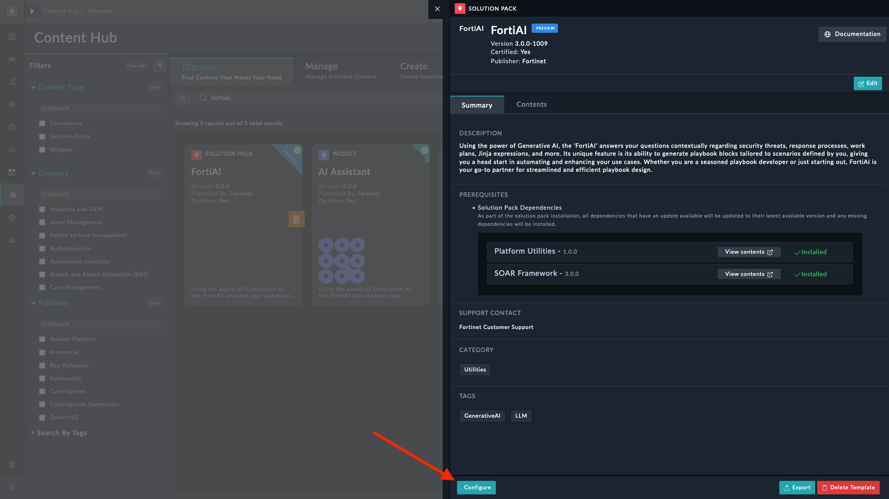
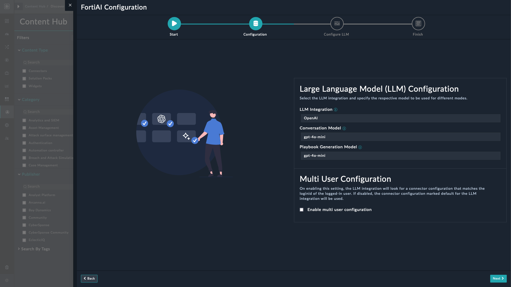
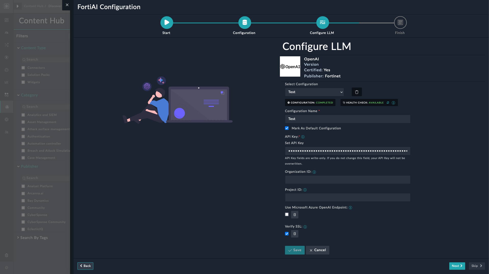
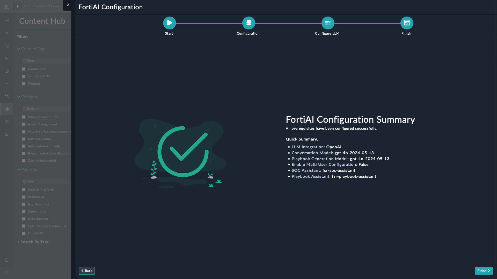

|[Home](../README.md) |
|---------------------|

# Installation

1. To install a solution pack, click **Content Hub** > **Discover**.
2. From the list of solution pack that appears, search **FortiAI**.
3. Click the **FortiAI** solution pack card.
4. Click **Install** on the lower part of the screen to begin the installation.

## Prerequisites

The **FortiAI** solution pack depends on the following solution packs.

| Name               | Type          | Version          | Purpose                                |
|:-------------------|:--------------|:-----------------|:---------------------------------------|
| SOAR Framework     | Solution Pack | v3.0.0 and later | Required for incident response modules |
| Platform Utilities | Solution Pack | v1.0.0 and later | Required for the key store module      |

You must have the following access and credentials to use this solution pack:

- An OpenAI account and a valid project level API key to access the OpenAI APIs. For information refer to [API Keys](https://platform.openai.com/docs/api-reference/api-keys) section of the OpenAI documentation. Following are the **_minimum_** permissions that must be assigned to users on the OpenAI interface:
    - **Administrator**
        - Assistant - **All**
        - Thread - **All**
    - **User**
        - Assistant - `Read`
        - Thread - **All**
    - The user must be a member of the project whose Project ID is being used.

- Access to supported OpenAI LLM models as versions prior to *`GPT4`* do not generate responses as expected.

To use the **FortiAI** solution pack, you must have **_at least_** the following permissions:

### Administration Permissions

The following permission allow an administrator to run the [configuration wizard](#fortiai-configuration-wizard):

| Module         | Create                             | Read                               | Update                             | Other   |
|:---------------|:-----------------------------------|:-----------------------------------|:-----------------------------------|:--------|
| Attachment     |  |  |  | -       |
| Connectors     |  |  |  | Execute |
| Content Hub    |         |  |         | -       |
| Files          |  |  |  | -       |
| Key Store      |         |  |  | -       |
| Playbooks      |         |  |         | Execute |
| Solution Packs |         |  |  | -       |
| Widgets        |         |  |  | Usage   |

### User Permissions

The following permission allow a user to interact with the **FortiSOAR AI Assistant** bot. Apart from these, users needs CRU (create, read, and update) permissions on the modules they are assigned to work. For example: users need to be assigned CRU permissions for the **Alert** module for them to manage or take action on an alert.

| Module      | Create                      | Read                               | Update                      | Other   |
|:------------|:----------------------------|:-----------------------------------|:----------------------------|:--------|
| Application |  |  |  | -       |
| Connectors  |  |         |  | Execute |
| Key Store   |  |  |  | -       |
| Playbooks   |  |  |  | Execute |
| Widgets     |  |         |  | Usage   |

>[!Note]
> The **FortiSOAR AI Assistant** bot becomes available to interact on modules that contain records like Alerts, Indicators, or Incidents. The bot is still available to interact on all such modules even if there are no records present.

# Configuration

The **FortiAI** solution depends on the following connectors and widgets:

- **AI Assistant Utils** connector to help interact with LLMs like OpenAI.

>[!NOTE]
>The AI Assistant Utils connector does not require a configuration. For more details, see the [AI Assistant Utils Connector](https://docs.fortinet.com/document/fortisoar/1.0.0/ai-assistant-utils/690/ai-assistant-utils-v1-0-0) document.

- The **AI Assistant** widget to add the **FortiSOAR AI Assistant** bot to the FortiSOAR user interface. For more details, see the [AI Assistant Widget](https://docs.fortinet.com/document/fortisoar/1.0.0/ai-assistant-utils/690/ai-assistant-utils-v1-0-0) document.

- The **OpenAI** connector to get a response from **FortiSOAR AI Assistant**.
    - To configure and use the OpenAI connector, see the [OpenAI Connector](https://docs.fortinet.com/document/fortisoar/2.0.0/openai/706/openai-v2-0-0) document.

## FortiAI Configuration Wizard

The wizard helps select the LLM Model, configure the OpenAI connector, and create &ndash; or update &ndash; the OpenAI Assistant. The OpenAI assistant handles SOC conversations and playbook generation.

The FortiAI Configuration wizard guides you through the following steps to setup FortiAI:

1. After [installation](#installation), click the **Configure** button.

    

2.  On the following wizard screen, click **Let's Get Started** to proceed.

    

3. On the **Configuration** page, select a value for the following fields:

    

    - **LLM Integration** &mdash; *OpenAI* (default).
    - **Conversation Model**: Select one from the following options:

        - `gpt-4o-mini-2024-07-18`
        - `gpt-4o-mini` (default)
        - `gpt-4o-2024-05-13`
        - `gpt-4-turbo-2024-04-09`

    - **Playbook Generation Model**: Select one from the following options:

        - `gpt-4o-mini-2024-07-18`
        - `gpt-4o-mini` (default)
        - `gpt-4o-2024-05-13`
        - `gpt-4-turbo-2024-04-09`

    -  Select **Enable multi user configuration** to use the connector configuration that matches the login ID of the logged-in user. Clear the selection to use the default configuration for the LLM integration.

4. Click **Next** on the lower-right corner.

    - Configure your LLM Integration (OpenAI) on the **Connect LLM** page using the project-level API key. For configuration details, refer to the [OpenAI connector configuration](https://docs.fortinet.com/fortisoar/connectors/openai) section on FortiSOAR connector page.

    

5. Click **Next** on the lower-right corner.

    

6. Click **Finish** to complete the configuration.

> [!IMPORTANT]  
> By default, all these fields are loaded from, and saved to, the **Key Store** record named *`fortiai-configuration`*.

Navigate to *Incident Response*, *Automation*, or *Resources* navigation menu to interact with **FortiSOAR AI Assistant**.

# Next Steps
| [Usage](./usage.md) | [Contents](./contents.md) |
|---------------------|---------------------------|
