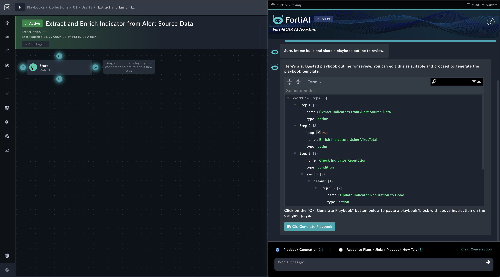
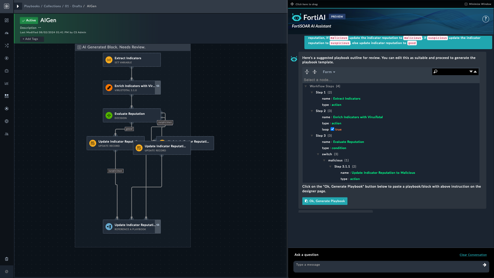
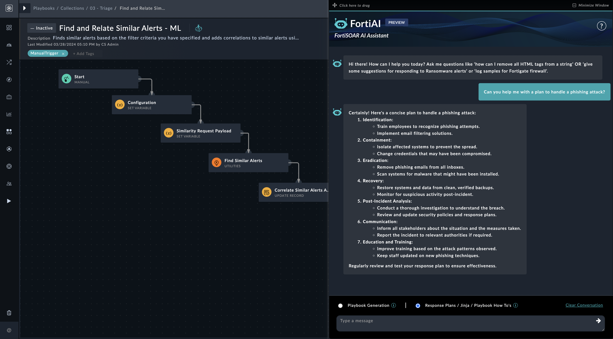
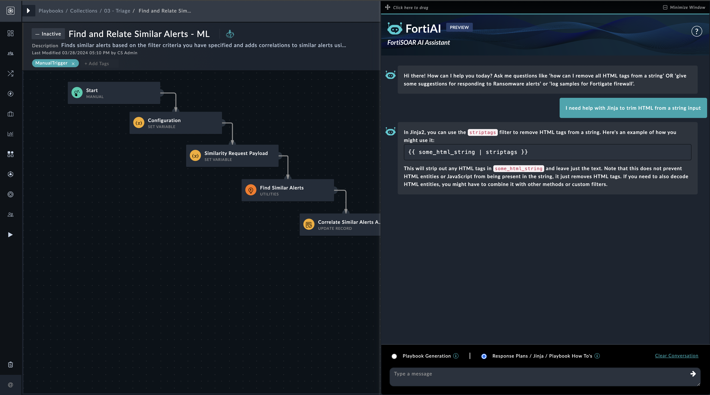

| [Home](../README.md) |
|----------------------|

# Usage

The **FortiAI** solution pack offers a variety of functions through its **AI Assistant** to managing and automating tasks related to cybersecurity workflows. Following is an overview of the supported functions:

- **Generate Playbook**: Generate, create a playbook or workflow, or playbook steps.
- **Navigate Pages**: Navigate, open, or move to a specific page or module.
- **Link Record**: Link or correlate a record with other relevant records. For example: correlating an indicator to an existing alert or incident.
- **Create Record**: Create a record for the specified type, page, or module.
- **Update Record**: Update a record using the updated information provided.
- **Block Indicator**: Block an indicator using a configured connector.
- **Enrich Indicator**: Fetch, get, or retrieve the latest reputation of an indicator.
- **Escalate To Incident**: Escalate, elevate, or promote the alert to an incident.
- **Setup War Room**: Establish, set up, initiate, or create a war room for an incident.

## Generating Playbooks

Generating playbooks with the OpenAI assistant allows you to streamline and automate threat mitigation processes efficiently. The following section provides detailed instructions on how to create and manage playbooks using the assistant's capabilities.

>[!TIP]
>It is recommended to create smaller playbook blocks for easier review and minimal changes in the JSON template generated by FortiAI. You can then combine these small playbook blocks to create a larger playbook for your desired workflow.

### Use Case Example: Mitigating Threats

One common use case involves creating a playbook to extract indicators from an alert and enrich them using a threat intelligence tool such as VirusTotal. Based on the reputation data received from VirusTotal, the playbook updates the indicator's reputation as follows:

- **Malicious**: If the reputation returned by VirusTotal is *Malicious*.
- **Suspicious**: If the reputation returned by VirusTotal is *Suspicious*.
- **Good**: If the reputation returned by VirusTotal is anything but *Suspicious*.

### Creating a Playbook Using Playbook Designer

1. **Initiate Playbook Designer**: To learn more about working with Playbook Designer, refer to the section [Creating Playbooks](https://docs.fortinet.com/document/fortisoar/7.6.0/playbooks-guide/331279/introduction-to-playbooks#Creating_Playbooks) in the Playbooks Guide of FortiSOAR product documentation.

   - From the **Playbook Designer**, type your requirements in a conversational format. For example:

    >*Extract Indicators from the Alert Source Data and enrich them using VirusTotal. Based upon reputation, if `malicious` update the indicator reputation to `malicious` else if `suspicious` update the indicator reputation to `suspicious` else update indicator reputation to good.*

2. **Modify Playbook Outline**:
   - Adjust the playbook outline as needed, such as changing the integration tool from VirusTotal to IPStack. You can edit the JSON file and write *IPStack* instead of *VirusTotal*. The bot can also handle if there are typos in specifying the connector name.     

    

3. **Generate Playbook**:
   - Once satisfied with the outline, click **Ok, Generate Playbook**.

>[!NOTE]
>If a step uses a connector that is not installed, FortiAI informs you with a message indicating that the specific step requires a connector that is not installed on the system.

4. **Monitor Playbook Generation**:
   - A loader image indicates the progress while FortiAI is generating playbook steps.
   
5. **Review Generated Playbook**:
   - After the steps have been generated, a suggested playbook block appears in the *Playbook Designer*. You can review each step by double-clicking it and examining the details.

    

6. **Integrate and Finalize Playbook**:
   - Connect the reviewed AI-generated playbook blocks to the main playbook flow to create a complete workflow.

The ability to generate playbooks through OpenAI's assistant represents a significant advancement in playbook design, offering immense assistance to those new to developing playbooks. By following the above steps, administrators can efficiently create and manage robust playbooks to address various threat mitigation scenarios.

[!TIP]
>It is recommended that you clear a conversation before executing different use cases. Clearing conversations also helps in saving tokens being consumed.

## Navigating Page

Navigating pages within the FortiAI assistant allows users to access various modules and records efficiently. This functionality enhances workflow efficiency and helps users locate and manage the required information across the system.

### Use Case Example: Accessing Records

One common use case involves accessing specific records quickly. For instance, a security analyst needs to review the details of a particular alert or incident. By issuing navigation commands, the analyst can access the required records without unnecessary delays.

### Navigating a Page Using FortiAI Assistant

1. **Initiate Navigation**:
   - Issue a command to navigate to a specific page or module. For example:

    >*Navigate to the Alerts module*

    or

    >*Navigate to Content Hub*

   - The assistant directs you to the requested module, such as Alerts, Incidents, Indicators, or in the above case &ndash; to Content Hub.

2. **Access a Specific Record**:
   - Provide details such as the record's identifier or name to access a particular record. For example:

    >*Open the record with ID [ALERT-ID]*

   - The assistant locates and displays the record for you. The response contains a hyperlink to the said record. Users can refer to previous conversations and navigate to the record using these links.

### Review Navigation Commands

- Review your navigation commands by verifying that they direct you to the correct module or record. Make adjustments if necessary to ensure accurate access.

### Integrate Navigation into Workflow

- Connect the navigation commands into your workflow to enhance efficiency. Utilize the commands to quickly move between modules and access the necessary records.

Effective navigation within FortiSOAR is crucial for managing tasks and accessing information efficiently. By following these steps and utilizing the FortiAI assistant's navigation capabilities, users can streamline their workflows and improve productivity.

>[!NOTE]
>Familiarize yourself with the specific commands for navigation to optimize your use of the FortiAI assistant.

## Providing Context

The bot automatically loads context of an already opened record so you can initiate conversation directly around the opened records.

For example, you can open an alert record and ask the bot for *Source IP* contained in the record.

> *What is the source IP in this record?*

>[!NOTE]
>Ensure that context provided is relevant and up-to-date to maintain accuracy in decision-making and task execution.

## Linking Records

Linking records within the FortiAI assistant involves correlating a record with other relevant records. This functionality helps establish connections between different pieces of information, such as correlating an indicator with an existing alert, to enhance data analysis and response actions.

### Use Case Example: Correlating an Indicator

A common use case is correlating an indicator with an existing alert. For example, if an alert is to be associated with an indicator, linking the indicator to the alert helps in understanding the relationship and impact. This correlation can aid in more accurate threat analysis and response.

### Linking Records Using FortiAI Assistant

1. **Initiate Linking**:
   - Issue a command to link a record with another relevant record. For example:

    >*Link indicator ID [INDICATOR-ID] to alert ID [ALERT-ID]*

   - The assistant establishes the connection between the specified indicator and alert.

2. **Correlate Records**:
   - Specify the records you want to correlate. For example:

    >*Correlate the newly detected IP [INDICATOR-ID] with the [INCIDENT-ID]*

   - The assistant identifies and establish correlations between the specified records.

### Review Linked Records

- Verify the accuracy and relevance of the linked records. Ensure that the connections provide a clear understanding of the relationships and contribute to effective analysis.

### Integrate Linked Records into Workflow

- Utilize the linked records to enhance your workflow. The connections between records can provide valuable insights and help streamline data analysis and response actions.

Linking records is crucial for establishing connections between related pieces of information within FortiSOAR.

>[!TIP]
>When linking records, ensure that the connections are relevant and meaningful. Properly linking records can provide a more comprehensive view and improve the effectiveness of your analysis and response.

## Creating Records

>[!NOTE]
>For *Create Record* operation, the bot expects the `ID` and `UUID` of the records; if the records context is not present in the bot conversation history.

Creating records within the FortiAI assistant involves generating new entries for specified types, pages, or modules. This functionality allows users to add new data to the system, such as creating a new alert or incident record, to manage and track information effectively.

>[!NOTE]
>Ensure that you provide all the relevant details for records to be accurate and complete. Proper record creation supports effective data management and enhances the overall workflow.

### Use Case Example: Creating a New Incident

A common use case is creating a new incident record when a new threat is detected. For example, if an alert indicates a potential security breach, a new incident record can be created to track and manage the response.

### Creating Records Using FortiAI Assistant

1. **Initiate Record Creation**:
   - Issue a command to create a record for the specified type, page, or module. For example:

    >*Create a new incident record in the Incidents module*

   - The assistant prompts you to provide the necessary details for the new record.

2. **Specify Record Details**:
   - Provide the required information for the record being created. For example:

    >*Create a new alert with the following details: `[Details of the alert]`*

   - The assistant generates the new record based on the provided details. If any mandatory details are missed, the bot requests for the missing information.

### Review Created Records

- Verify the accuracy and completeness of the created records. Ensure that all necessary information is included and that the record meets the required specifications.

### Integrate Created Records into Workflow

- Utilize the newly created records within your workflow. The records can be used for tracking, analysis, and response actions, contributing to an efficient data management process.

Creating records is a fundamental task for managing and tracking data within FortiSOAR. By following the steps outlined and leveraging the FortiAI assistant’s capabilities, users can effectively create and manage records to support their workflow and data management needs.

>[!NOTE]
>On an MSSP setup, users cannot prompt the bot from a master to create a record on a tenant other than *`Self`*.

## Updating Records

>[!NOTE]
>For *Update Record*, the bot expects the `ID` and `UUID` of the records; if the records context is not present in the bot conversation history.

Updating records within the FortiAI assistant involves modifying existing entries with new or updated information. This functionality ensures that records remain accurate and relevant by reflecting the latest data.

### Use Case Example: Updating Incident Details

A common use case is updating an incident record with new information, such as additional findings or changes in status. For instance, if new evidence is discovered during an investigation, updating the incident record with this information helps maintain an accurate and comprehensive record.

### Updating Records Using FortiAI Assistant

1. **Initiate Record Update**:
   - Issue a command to update a record with the new information. For example:

    >*Update the incident with ID [ALERT-ID] with the following details: [Updated details]*

   - The assistant prompts you to provide the updated information for the record.

2. **Provide Updated Information**:
   - Specify the details to be updated in the record. For example:

    >*Update the alert status to "Resolved" and add a note: [Details of the note]*

   - The assistant applies the changes to the record based on the provided information.

### Review Updated Records

- Verify that the record has been updated correctly with the new information. Ensure that all changes are accurate and that the record reflects the most recent data.

>[!WARNING]
>Updating records action overwrites any existing value in a field.

### Integrate Updated Records into Workflow

- Utilize the updated records within your workflow to ensure that your data and analysis reflect the most current information. The updated records can aid in making informed decisions and managing tasks effectively.

Updating records is a crucial task for maintaining accurate and relevant information within FortiSOAR. By following the outlined steps and using the FortiAI assistant’s capabilities, users can effectively manage and update records to support their workflow and data accuracy.

## Blocking Indicators

Blocking an indicator within the FortiAI assistant involves using a configured connector to prevent or mitigate the impact of the indicator. This functionality is crucial for managing security threats by stopping potentially harmful indicators from affecting your systems.

### Use Case Example: Blocking a Malicious IP Address

A common use case is blocking a malicious IP address that has been identified as a threat. For example, if an IP address is flagged as malicious, blocking it prevents further interactions with the threat, protecting your network from potential harm.

### Blocking Indicators Using FortiAI Assistant

1. **Initiate Blocking Action**:
   - Issue a command to block the indicator using the [configured connector]. For example:

    >*Block IP address `[IP-ADDRESS]`*

   - The assistant triggers a playbook to block the indicator. If the playbook execution takes time, the bot presents a link to the playbook execution log.

2. **Provide Indicator Details**:
   - Specify the details of the indicator to be blocked. For example:

    >*Block domain `[DOMAIN]` due to malicious activity*

   - The assistant processes the request and blocks the indicator accordingly.

### Review Blocking Actions

- Confirm that the blocking action has been executed correctly and that the indicator is no longer active. Ensure that the blocking process has addressed the threat effectively.

### Integrate Blocking Actions into Workflow

- Incorporate the blocking action into your security workflow to prevent further interactions with the threat. Utilize the blocked indicator information for ongoing analysis and monitoring.

Blocking indicators is an essential task for managing security threats within FortiSOAR. By following the outlined steps and using the FortiAI assistant’s capabilities, users can effectively block harmful indicators and protect their systems.

>[!Note]
>Ensure that the connector used for blocking is properly configured to execute the blocking action accurately.

## Enriching Indicators

Enriching an indicator within the FortiAI assistant involves fetching or retrieving the latest reputation information for the indicator. This functionality helps users gain up-to-date insights into the threat level associated with an indicator, such as an IP address, domain, or file hash.

### Use Case Example: Retrieving Reputation of an IP Address

A common use case is retrieving the reputation of an IP address to assess its threat level. For example, if an IP address is flagged in an alert, fetching its reputation helps determine whether it is malicious, suspicious, or benign.

### Enriching Indicators Using FortiAI Assistant

1. **Initiate Enrichment Request**:
   - Issue a command to fetch the latest reputation of the indicator. For example:

    > *Retrieve the reputation of IP address `[IP-ADDRESS]`*

   - The assistant queries the relevant sources to get the current reputation information.

2. **Specify Indicator Details**:
   - Provide the details of the indicator for which reputation is to be fetched. For example:

    > *Get the latest reputation for domain `[DOMAIN]`*

   - The assistant retrieves the most recent reputation data for the specified indicator.

### Review Enriched Indicators

- Verify the accuracy and relevance of the reputation information retrieved. Ensure that the data reflects the most current assessment of the indicator.

### Integrate Enriched Indicators into Workflow

- Use the enriched reputation information to inform your security analysis and response actions. Incorporate the data into your workflow to enhance decision-making and threat management.

Enriching indicators is a critical task for understanding threat levels within FortiSOAR. By following the outlined steps and leveraging the FortiAI assistant’s capabilities, users can effectively retrieve and utilize the latest reputation information to support their security operations.

## Escalating an Alert To Incident

Escalating an alert to an incident within the FortiAI assistant involves promoting an alert to a higher level of response. This functionality is essential for managing critical alerts that require more detailed investigation and response actions.

### Use Case Example: Escalating an Alert to an Incident

A common use case is escalating an alert that indicates a significant security threat, which needs to be tracked and managed as an incident. For example, an alert about a potential data breach may be escalated to an incident for comprehensive investigation and remediation.

### Escalating Alerts Using FortiAI Assistant

1. **Initiate Escalation Action**:
   - Issue a command to escalate the alert to an incident. For example:

    > *Promote alert with ID [ALERT-ID] to an incident*

   - The assistant triggers a playbook that asks for information like incident name and severity before escalating the alert to the incident.

2. **Provide Alert Details**:
   - Specify the details of the alert that needs to be escalated. For example:

    > *Escalate alert [ALERT-ID] with subject [ALERT-SUBJECT] to incident*

   - The assistant processes the escalation request and generates the incident accordingly.

>[!NOTE]
>A manual input is presented by the bot, if the alert being escalated is open. Alternatively, you can access pending manual inputs under **Pending Tasks** on the FortiSOAR tool bar.

### Review Escalated Incidents

- Confirm that the escalation process has been completed successfully and that the new incident record contains all necessary information. Review the incident to ensure it is properly documented and ready for further action.

### Integrate Escalated Incidents into Workflow

- Incorporate the escalated incident into your workflow for comprehensive management and response. Use the incident record to track progress, assign tasks, and coordinate responses.

Escalating alerts to incidents is a crucial process for managing significant security threats within FortiSOAR. By following the outlined steps and utilizing the FortiAI assistant’s capabilities, users can effectively promote alerts to incidents and manage them with appropriate detail and urgency.

>[!Note]
>Ensure that all necessary details from the alert are accurately included in the incident record to support effective investigation and resolution.

## Setting Up a War Room

Setting up a war room within the FortiAI assistant involves creating a dedicated space for managing and responding to an incident. This functionality is crucial for coordinating efforts, sharing information, and making decisions during incident response.

### Use Case Example: Establishing a War Room for a Data Breach Incident

A common use case is setting up a war room for a significant incident, such as a data breach, where various teams need to collaborate and respond quickly. Creating a war room allows for streamlined communication and efficient management of the incident.

### Setting Up a War Room Using FortiAI Assistant

1. **Initiate War Room Setup**:
   - Issue a command to set up a war room for the incident. For example:

    > *Establish a war room for incident [INCIDENT-ID]*

   - The assistant creates a new war room associated with the specified incident.

2. **Provide Incident Details**:
   - Specify the details of the incident for which the war room is to be set up. For example:

    > *Create a war room for incident [INCIDENT-ID] involving [INCIDENT-DESCRIPTION]*

   - The assistant processes the request and initiate the war room setup accordingly.

>[!NOTE]
>A manual input is presented by the bot, if the incident record is open. Alternatively, you can access pending manual inputs under **Pending Tasks** on the FortiSOAR tool bar.

### Review War Room Setup

- Confirm that the war room setup process has been completed successfully and that the new war room contains all necessary information. Review the war room configuration to ensure it is ready for use.

### Integrate War Room into Workflow

- Incorporate the war room into your incident response workflow to facilitate coordination and communication. Use the war room to track progress, assign tasks, and manage the incident effectively.

>[!Tip]
>Regularly update the war room with the latest information and ensure all relevant team members have access. An up-to-date war room enhances collaboration and response efficiency.

Setting up a war room is a critical process for managing significant incidents within FortiSOAR. By following the outlined steps and utilizing the FortiAI assistant’s capabilities, users can effectively establish and use war rooms to coordinate incident response and resolution.

>[!Note]
>Ensure that all necessary stakeholders are included in the war room to facilitate comprehensive incident management and decision-making.

## Building Response Plans

Building response plans within the FortiAI assistant involves creating structured action plans for investigating and responding to security events. This functionality is essential for users who need to develop comprehensive response strategies for various security incidents.

### Use Case Example: Creating a Plan for a Ransomware Event

A common use case is creating a response plan for a ransomware event. For example, developing a step-by-step action plan to investigate and mitigate a ransomware attack.

### Building Response Plans Using FortiAI Assistant

1. **Initiate Response Plan Creation**:
   - Open the playbook designer and type your query. For example:

    > *Can you help me with a plan to handle a phishing attack?*

   - Click the  icon to submit your query, or press *Enter*.

    

2. **Receive Framework for Response Plan**:
   - FortiAI provides a framework for a response plan based on your query. For example, it may suggest steps such as identifying phishing emails, isolating affected systems, and notifying relevant stakeholders.

3. **Design Playbooks Using Provided Framework**:
   - Use the provided framework to design detailed playbooks. Utilize the **Playbook Generation** option to create specific steps and actions based on the response plan.

### Review and Customize Response Plans

- Verify that the suggested response plan framework meets your requirements. Customize the framework to fit the specific details of your security event and organizational policies.

### Integrate Response Plans into Workflow

- Integrate the developed response plans into your incident response workflow. Use the playbooks to coordinate and execute the response actions effectively.

>[!Tip]
>Regularly update and review your response plans to ensure they align with the latest threat intelligence and organizational changes. Keeping response plans current enhances their effectiveness.

Building response plans is a critical task for managing security incidents within FortiSOAR. By following the outlined steps and leveraging the FortiAI assistant’s capabilities, users can effectively create and implement comprehensive response plans to handle various security events.

>[!Note]
>Ensure that all response plans are thoroughly tested and validated to ensure they work as intended during actual incidents.

## Getting Help with a Jinja Expression

Getting assistance with Jinja expressions within the FortiAI assistant involves receiving guidance on creating or understanding Jinja expressions used in reference playbooks. This functionality is essential for users who need help with crafting or debugging Jinja templates to automate tasks in FortiSOAR.

### Use Case Example: Crafting a Jinja Expression for Data Extraction

A common use case is needing help to create a Jinja expression that extracts specific data from a JSON object within a playbook. For example, extracting an IP address from an alert's details.

### Getting Help with Jinja Expressions Using FortiAI Assistant

1. **Request Jinja Expression Assistance**:
   - Issue a command to get help with a Jinja expression. For example:

    > *Help me create a Jinja expression to extract the IP address from the alert data*

   - The assistant provides guidance or suggestions for the Jinja expression based on the request.

2. **Specify Jinja Expression Requirements**:
   - Provide details about the Jinja expression you need help with. For example:

    > *I need a Jinja expression to extract the field `source_ip` from the alert*

   - The assistant processes the request and offers a suitable Jinja expression or provide tips for constructing it.

### Review Jinja Expression Guidance

- Confirm that the guidance or expression provided by the assistant is accurate and relevant to your needs. Make necessary adjustments to fit your specific use case.

    

### Integrate Jinja Expressions into Playbooks

- Use the Jinja expressions in your playbooks to automate tasks and data extraction. Incorporate the expressions into your workflow to enhance efficiency and accuracy.

Getting help with Jinja expressions is a valuable feature for enhancing automation within FortiSOAR. By following the outlined steps and leveraging the FortiAI assistant’s capabilities, users can effectively create and debug Jinja expressions to support their playbook development.

>[!TIP]
>Ensure that the Jinja expressions are properly tested and validated before integrating them into production playbooks to avoid errors and ensure smooth operation.

## Ask a contextual question to FortiAI

FortiAI takes on an interactive role, offering valuable assistance through conversations in a natural language. To maintain the flow of conversation and context, it loads past 20 messages in the conversation window.

>[!NOTE]
>To modify this behavior, edit the `messagesLimit` parameter in the `fortiai-configurations` **Key Store** record.

You can engage in contextual conversation with FortiAI in the list view and detail view of modules in FortiSOAR, where you can seek guidance, recommendations, information about the latest threats, security processes etc. FortiAI provides insightful responses, leveraging its extensive knowledge base.

In context of a malware (Dragonfly) alert, to know more about that malware, click the **FortiAI** icon in the alert detail view.

In the **Ask a question** text box, type

>*Can you provide me with more information about the Dragonfly Malware?*

Press **Enter** to get more information about the malware that is relevant to the alert in question, as shown in the following image:

  

FortiAI provides a summary about the malware and its associated threat groups. It also informs you that this malware has been observed in phishing campaigns and is designed to exploit vulnerabilities in common file formats, such as docx.

## Module Specific Question 

- Open an alert and click the bot icon. Some pre-defined questions appear:

  

- Select a question to retrieve information about the opened alert.

For advanced usage topics, such as prompting tips n tricks, see [Advanced Usage](./advanced-usage.md).

| [Installation](./setup.md#installation) | [Configuration](./setup.md#configuration) | [Contents](./contents.md) |
|-----------------------------------------|-------------------------------------------|---------------------------|
